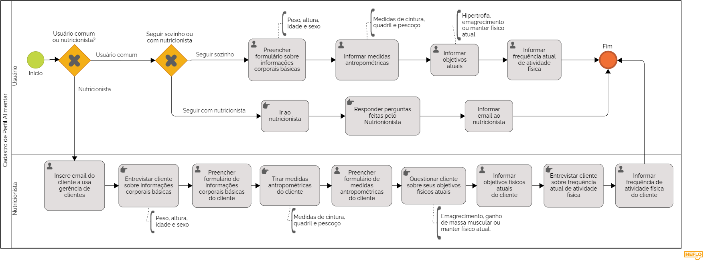

# 3.3.2 Processo 2 – Cadastro de Perfil Alimentar

A função deste processo é de identififcar as necessidades do usuário e qual seus objetivos usando a aplicação. 
Para melhorar este processo deve-se pensar de forma a fazer uma pesquisa intuitiva, rápida e eficiente com o usuário.
O processo deverá ser finalizado mostrando uma recomendação de acordo com aquilo que o usuário respondeu. 

## Diagrama

## Detalhamento de Atividades

### Tipo de Usuário

_Verifica-se se o usuário é nutricionista ou um usuário comum._

### Seguir sozinho ou com nutricionista
 O usuário escolhe se será atendido por um nutricionista ou não

### Usuário Comum Sem Nutricionista

_**Informaçoes corporais básicas:** Usuário preenche um formulário coms suas informações corporais basicas como peso, altura, idade e sexo_

_**Medidas antropométricas:** Usuário informa suas medidas do de cintura, quasril e pescoço_

_**Objetivos atuais:** Usuário informa qual o seu objetivo atual: Hipertrofia, emagrecimento, ou manter fisico atual_

_**Frequência de atividade física:** Usuário seleciona com qual frequência se exercita por semana_

_**Cálculo de macros e calorias:** Após terminar de realizar seu perfil alimentar o Usuário é encaminhado a tela de comparaçao de calorias e macronutrientes_

### Usuário Comum Com Nutricionista

_**Entrevista com nutricionista:** Ir ao nutricionista ser entrevistado para o perfil alimenar._

_**Informar email ao nutricionista:** Informa email ao nutricionista para que assim ele possa fazer seu gerenciamento_

### Nutricionista

_**Informaçoes corporais básicas:** Ao longo da entrevista com cliente o nutricionista preenche um formulário com as informações corporais basicas do mesmo como peso, altura, idade e sexo_

_**Medidas antropométricas:** Após tirar medidas de seu cliente o nutricionista as informa como pescoço, quadril, cintura..._

_**Frequência de atividade fisica:** Após entrevista com seu cliente o nutricionista informa com que frequência o mesmo se exercita._

_**Objetivos atuais:** Após questionario com seu cliente o nutricionista informa qual o objetivo do mesmo seja ganhar massa muscular, emagrecimento, ficar em forma, manter fisoco atual..._

_**Frequência de atividade física:** Nutricionista questiona o cliente sobre quantas vezes se exercita por semana e seleciona opção_

**Atividade 1: Seguir sozinho ou com nutricionista**

| **Campo** | **Tipo** | **Restrições** | **Valor default** |
| --- | --- | --- | --- |
| Escolha de Primeiro acesso | Seleção ùnica | Seguir sozinho / ser acompanhado por um nutricionista | --- |

| **Comandos** | **Destino** | **Tipo** |
| --- | --- | --- |
| Seguir sozinho | Página de cadastro de perfil Alimentar | --- |
| Acompanhado por Nutricionista | Página de informar Email ao Nutricionista | --- |

**Atividade 2: Preencher formulário de informações corporais básicas**

| **Campo** | **Tipo** | **Restrições** | **Valor default** |
| --- | --- | --- | --- |
| Peso | Número | Maior que zero e em KG| --- |
| Altura | Número | Maior que zero e em Cm| --- |
| Idade | Número | Maior que zero | --- |
| Sexo | Seleção única | Masculino/Feminino | --- |

**Atividade 3: Informar medidas antropométricas**

| **Campo** | **Tipo** | **Restrições** | **Valor default** |
| --- | --- | --- | --- |
| Pescoço | Número | Maior que zero e em Cm | --- |
| Cintura | Número | Maior que zero e em Cm | --- |
| Quadril | Número | Maior que zero e em Cm | --- |

**Atividade 4: Informar objetivos atuais**
| **Campo** | **Tipo** | **Restrições** | **Valor default** |
| --- | --- | --- | --- |
| Objetivo | Seleção única | Emagrecimento/Hipertrofia/Manter Físico atual| --- |

**Atividade 5: Informar frequência de atividade física**

| **Campo** | **Tipo** | **Restrições** | **Valor default** |
| --- | --- | --- | --- |
| Frequência | Seleção única | Sedentário/Leve/Moderado/Ativo/Pesado | --- |

| **Comandos** | **Destino** | **Tipo** |
| --- | --- | --- |
| Finalizar Cadastro | Página inicial com usuário logado | --- |

