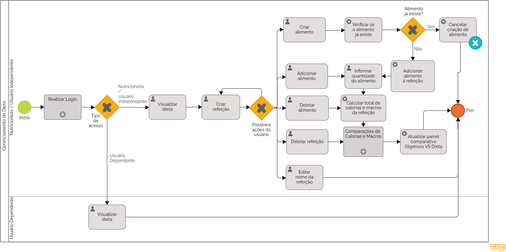

# 3.3.3 Processo 3 – Gerenciamento de Dieta

Este processo visa proporcionar uma experiência eficiente e intuitiva para os usuários no que diz respeito à criação e gerenciamento de dietas. Uma oportunidade de melhoria seria garantir uma interface de usuário amigável e informativa, fornecendo feedback claro e útil sobre a adequação da dieta em relação às metas estabelecidas.

## Diagrama

## Detalhamento de atividades

### Tipo de acesso

**Se o usuário for um cliente de um nutricionista:** poderá somente visualizar a dieta, e não editá-la

**Se o usuário for um nutricionista ou um usuário independente:** poderá visualizar e editar a dieta

### Possíveis ações do usuário

**Usuário seleciona "Criar Refeição":** usuário clica no botão "Criar refeição" no menu principal, o que renderiza uma nova caixa de refeição.

Após uma refeição ter sido criada, o usuário pode realizar várias ações diferentes relacionadas a ela - além de criar outra refeição.

**Usuário cria/edita nome da refeição:** usuário clica no campo referente ao nome da refeição e digita o texto.

**Usuário seleciona "Deletar Refeição":** usuário clica no botão "Deletar refeição" dentro da caixa da refeição, o que deleta ela da página e do banco de dados, juntamente com os alimentos dentro dela.

**Usuário seleciona "Criar Alimento":** usuário clica no botão "Criar alimento" dentro da caixa da refeição, o que renderiza um painel com campos refentes ao novo alimento - nome, calorias, proteínas, carboidratos, gorduras e tipo de porção (unidade ou gramas). Após preencher os campos, o sistema checa se o "novo" alimento já existe ou não no banco de dados:
- Se sim, a criação do alimento é cancelada;
- Se não, o novo alimento é salvo no banco de dados e adicionado à refeição (com um campo "Quantidade" vazio).

**Usuário seleciona "Adicionar Alimento":** usuário clica no botão "Adicionar alimento" que abre um menu dropdown com todas as opções de alimento no banco de dados. Ao selecionar uma das opções, ela é adicionada à refeição (com um campo "Quantidade" vazio).

**Usuário preenche/edita a quantidade do alimento:** esta tarefa vem depois do usuário criar um novo alimento ou adicionar um alimento. O usuário preenche o campo "Quantidade" do alimento com um número referente à quantidade desejada do alimento.

**Usuário seleciona "Deletar Alimento":** usuário clica no botão "Deletar alimento" que remove o alimento da caixa da refeição

**Cálculo do total de calorias e macros da refeição:** esta tarefa é acionada após o usuário informar a quantidade de um alimento ou deletar um alimento. O sistema irá recalcular o total de calorias e macros da refeição após a alteração.

**Acionamento do processo de Comparações de Calorias e Macros:** o processo será acionado após se deletar uma refeição ou se calcular o total de calorias e macros de uma refeição. O processo irá calcular o total de calorias e macros de toda a dieta, e em seguida irá comparar os valores com as calorias e macros do objetivo do usuário.

**Atualização do painel comparativo:** finalmente, com os dados do processo de comparação, o painel será atualizado exibindo para o usuário o novo status dele em relação ao seu objetivo após a última alteração feita.

**Criar refeição**

| **Campo**       | **Tipo**         | **Restrições** | **Valor default** |
| ---             | ---              | ---            | ---               |
| Refeição | Seleção única | Não pode estar em branco, máximo de 50 caracteres | (default) |

**Editar nome da refeição**

| **Campo**       | **Tipo**         | **Restrições** | **Valor default** |
| ---             | ---              | ---            | ---               |
| Refeição | Caixa de texto | Máximo de 50 caracteres, deve ser uma refeição previamente criada no sistema | (default) |

**Deletar refeição**

| **Campo**       | **Tipo**         | **Restrições** | **Valor default** |
| ---             | ---              | ---            | ---               |
| Refeição | Seleção única | Deve ser uma refeição previamente criada no sistema | (default) |

**Criar alimento**

| **Campo**       | **Tipo**         | **Restrições** | **Valor default** |
| ---             | ---              | ---            | ---               |
| Alimento | Caixa de texto | Não pode estar em branco, máximo de 50 caracteres| (default) |
| Alimento | Caixa de texto | Não pode estar em branco, máximo de 50 caracteres| (default) |
| Alimento | Caixa de texto | Não pode estar em branco, máximo de 50 caracteres| (default) |
| Alimento | Caixa de texto | Não pode estar em branco, máximo de 50 caracteres| (default) |
| Alimento | Caixa de texto | Não pode estar em branco, máximo de 50 caracteres| (default) |

**Adicionar alimento**

| **Campo**       | **Tipo**         | **Restrições** | **Valor default** |
| ---             | ---              | ---            | ---               |
| Alimento | Seleção única| Deve ser uma refeição previamente criada no sistema | (default) |

**Informar quantidade do alimento**

| **Campo**       | **Tipo**         | **Restrições** | **Valor default** |
| ---             | ---              | ---            | ---               |
| Quantidade | Número | Maior que zero | (default) |

**Deletar alimento**

| **Campo**       | **Tipo**         | **Restrições** | **Valor default** |
| ---             | ---              | ---            | ---               |
| Alimento | Seleção única | Deve ser um alimento previamente criada no sistema | (default) |

| **Comandos**         |  **Destino**                   | **Tipo** |
| ---                  | ---                            | ---               |
| Verificar se o alimento já existe | Busca no banco de alimentos se já existe um alimento com o mesmo nome | (default) |
| Cancelar criação de alimento | Interrompe e anula a requisição de criação de novo alimento | (default) |
| Adicionar alimento à refeição | Adiciona o alimento recém-criado à refeição em que a caixa de criação foi aberta | (default) |
| Calcular total de calorias e macros da refeição | Soma as calorias e macros de cada alimento (baseado na quantidade do mesmo) e exibe num painel na região infeiror da caixa da refeição | (default) |
| Atualizar painel comparativo "Objetivos VS Dieta" | Recalcula a diferença entre as calorias e macros recomendados nos objetivos do usuário e o total da soma de calorias e macros de todas as refeições da dieta | (default) |
