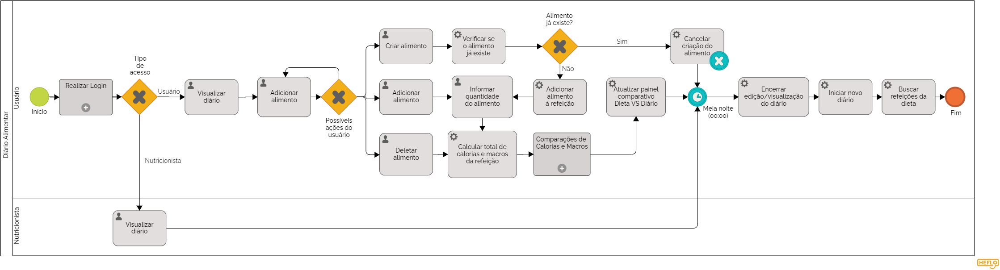

# 3.3.4 Processo 4 – Diário Alimentar

O processo abaixo busca detalhar como o acompanhamento alimentar do usuário é realizado pelo nosso sistema. Para melhoria desse processo, o sistema deve oferecer uma interface intuitiva e mostrar um feedback claro sobre a alimentação do usuário.

## Diagrama

## Detalhamento de atividades

### Tipo de acesso

**Se o usuário for um cliente ou um usuário independente:** poderá somente visualizar o diário, e não editá-lo

**Se o usuário for um nutricionista:** poderá visualizar e editar o diário

### Possíveis ações do usuário

**Usuário seleciona "Criar Alimento":** usuário clica no botão "Criar alimento" dentro da caixa da refeição, o que renderiza um painel com campos refentes ao novo alimento - nome, calorias, proteínas, carboidratos, gorduras e tipo de porção (unidade ou gramas). Após preencher os campos, o sistema checa se o "novo" alimento já existe ou não no banco de dados:
- Se sim, a criação do alimento é cancelada;
- Se não, o novo alimento é salvo no banco de dados e adicionado à refeição (com um campo "Quantidade" vazio).

**Usuário seleciona "Adicionar Alimento":** usuário clica no botão "Adicionar alimento" que abre um menu dropdown com todas as opções de alimento no banco de dados. Ao selecionar uma das opções, ela é adicionada à refeição (com um campo "Quantidade" vazio).

**Usuário preenche/edita a quantidade do alimento:** esta tarefa vem depois do usuário criar um novo alimento ou adicionar um alimento. O usuário preenche o campo "Quantidade" do alimento com um número referente à quantidade desejada do alimento.

**Usuário seleciona "Deletar Alimento":** usuário clica no botão "Deletar alimento" que remove o alimento da caixa da refeição

**Cálculo do total de calorias e macros da refeição:** esta tarefa é acionada após o usuário informar a quantidade de um alimento ou deletar um alimento. O sistema irá recalcular o total de calorias e macros da refeição após a alteração.

**Acionamento do processo de Comparações de Calorias e Macros:** o processo será acionado após se deletar uma refeição ou se calcular o total de calorias e macros de uma refeição. O processo irá calcular o total de calorias e macros do dia todo, e em seguida irá comparar os valores com as calorias e macros da dieta do usuário.

**Atualização do painel comparativo:** finalmente, com os dados do processo de comparação, o painel será atualizado exibindo para o usuário o novo status dele em relação ao seu objetivo após a última alteração feita.

**Sequência de tarefas à meia noite:** como o próprio nome sugere, um diário corresponde às 24 horas de um dia - ou seja, à meia noite encerra-se um dia e inicia-se outro, e é exatamente isso que ocorre na aplicação como veremos nas atividades abaixo.

**Encerramento do diário:** o diário do dia anterior é salvo uma última vez no banco de dados, e a partir desse momento não será mais possível editá-lo.

**Início do novo diário:** é criado um novo diário no banco de dados, com a data do dia que acabou de começar, e as requisições à página passam a fazer referência a esse novo diário.

**Carregamento das refeições da dieta:** as refeições da dieta são duplicadas e renderizadas na página do diário (somente as refeições, sem os alimentos).

**Criar alimento**

| **Campo**       | **Tipo**         | **Restrições** | **Valor default** |
| ---             | ---              | ---            | ---               |
| Alimento | Caixa de texto | Máximo de 50 caracteres, não pode estar em branco | (default) |
| Alimento | Caixa de texto | Não pode estar em branco, máximo de 50 caracteres| (default) |
| Alimento | Caixa de texto | Não pode estar em branco, máximo de 50 caracteres| (default) |
| Alimento | Caixa de texto | Não pode estar em branco, máximo de 50 caracteres| (default) |
| Alimento | Caixa de texto | Não pode estar em branco, máximo de 50 caracteres| (default) |

**Adicionar alimento**

| **Campo**       | **Tipo**         | **Restrições** | **Valor default** |
| ---             | ---              | ---            | ---               |
| Alimento | Seleção única | Deve ser um alimento previamente definido no sistema | (default) |

**Informar quantidade do alimento**

| **Campo**       | **Tipo**         | **Restrições** | **Valor default** |
| ---             | ---              | ---            | ---               |
| Quantidade | Número | Maior que zero | (default) |

**Deletar alimento**

| **Campo**       | **Tipo**         | **Restrições** | **Valor default** |
| ---             | ---              | ---            | ---               |
| Alimento | Seleção única | Deve ser um alimento previamente definido no sistema | (default) |

| **Comandos**         |  **Destino**                   | **Tipo** |
| ---                  | ---                            | ---               |
| Verificar se o alimento já existe | Busca no banco de alimentos se já existe um alimento com o mesmo nome | (default) |
| Cancelar criação de alimento | Interrompe e anula a requisição de criação de novo alimento | (default) |
| Adicionar alimento à refeição | Adiciona o alimento recém-criado à refeição em que a caixa de criação foi aberta | (default) |
| Calcular total de calorias e macros da refeição | Soma as calorias e macros de cada alimento (baseado na quantidade do mesmo) e exibe num painel na região infeiror da caixa da refeição | (default) |
| Atualizar painel comparativo "Dieta VS Diário" | Recalcula a diferença entre as calorias e macros da dieta - montada no processo de Gerenciamento de Dieta - e o total da soma de calorias e macros de todas as refeições do dia | (default) |
| Encerrar edição/visualização do diário | Muda rota de endereçamento das requests para se referir ao novo diário | (default) |
| Iniciar novo diário | Cria um novo diário no banco de dados com a data do dia que acabou de começar - as requests passam a se referir a esse novo diário | (default) |
| Buscar refeições da dieta | Cria uma cópia das refeições da dieta, porém com chave estrangeira referente à ID do novo diário | (default) |
