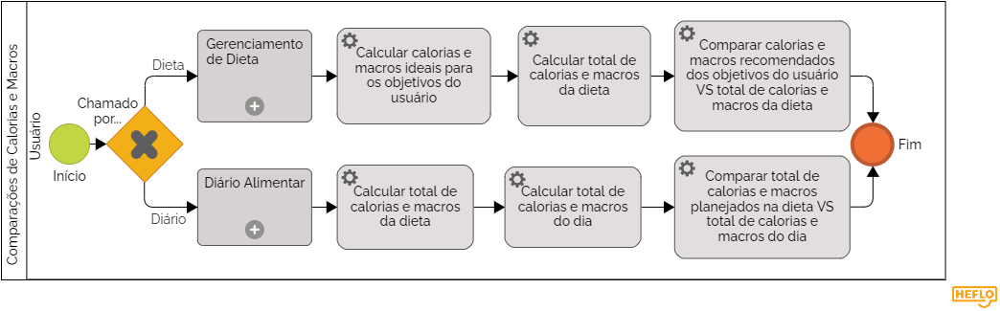

### 3.3.5 Processo 5 – Comparações de Calorias e Macros

O processo é dedicado à comparação das calorias e macronutrientes com base no perfil alimentar, dieta e seu consumo diario do usuário, mostrando assim o progresso em relação aos objetivos ideais. Uma oportunidade de melhora para esse processo poderia ser comparar também os alimentos planejados em cada refeição na dieta e os alimentos de fato consumidos no dia.

#### Detalhamento das atividades

#### Cálculo Total de Calorias e Macros da Dieta:

_**Calorias:** A quantidade de calorias necessárias para atingir o objetivo é calculada usando a taxa metabólica basal (TMB) e o nível de atividade física (NAF)._

_**Macros:** As proporções de macronutrientes (proteínas, carboidratos e gorduras) na dieta são definidas de acordo com o objetivo e as preferências do indivíduo._

#### Cálculo Total de Calorias e Macros do Dia:

_**Calorias:** As calorias totais da dieta são divididas pelas refeições do dia (café da manhã, almoço, lanche da tarde, jantar e ceia)._

_**Macros:** As proporções de macros na dieta são mantidas em cada refeição._

#### Comparação de Calorias e Macros:

_**Calorias:** Se a quantidade de calorias consumidas no dia for maior que a quantidade de calorias da dieta, o indivíduo está consumindo mais ou menos calorias do que o necessário para atingir seu objetivo._

_**Macros:** Se as proporções de macros consumidas no dia forem diferentes das proporções de macros da dieta, o indivíduo está consumindo mais ou menos de cada macronutriente do que o necessário para atingir seu objetivo._

**Atividade 1: Calcular calorias e macros ideais para os objetivos do usuário**

| **Comandos**         |  **Destino**                   | **Tipo** |
| ---                  | ---                            | ---               |
| Calcula total ideal de calorias e macronutrientes do seu objetivo | Baseado no objetivo desejado é feito o calculo do total de macro e calorias necessarias | (default) |

**Atividade 2: Calcular total de calorias e macros da dieta**

| **Comandos**         |  **Destino**                   | **Tipo** |
| ---                  | ---                            | ---               |
| Calcula total de calorias e macros da dieta | Soma as calorias e macros de cada alimento (baseado na quantidade do mesmo) de todas as refeições | (default) |

**Atividade 3: Calcular total de calorias e macros do dia**

| **Comandos**         |  **Destino**                   | **Tipo** |
| ---                  | ---                            | ---               |
| Calcula total de calorias e macros da dia | Soma as calorias e macros de cada alimento (baseado na quantidade do mesmo) de todas as refeições | (default) |

**Atividade 4: Comparar calorias e macros recomendados dos objetivos do usuário VS total de calorias e macros da dieta**

| **Comandos**         |  **Destino**                   | **Tipo** |
| ---                  | ---                            | ---               |
| Compara o total dos objetivos com o total da dieta | Comparação feita a partir da subtração das calorias e macros dos objetivos pelo total atual de calorias e macros da dieta | (default) |

**Atividade 5: Comparar total de calorias e macros planejados na dieta VS total de calorias e macros do dia**

| **Comandos**         |  **Destino**                   | **Tipo** |
| ---                  | ---                            | ---               |
| Compara o consumo diário com o desejado na dieta | Comparação feita a partir da subtração das calorias e macros da dieta pelo total atual do que foi consumido no dia | (default) |

